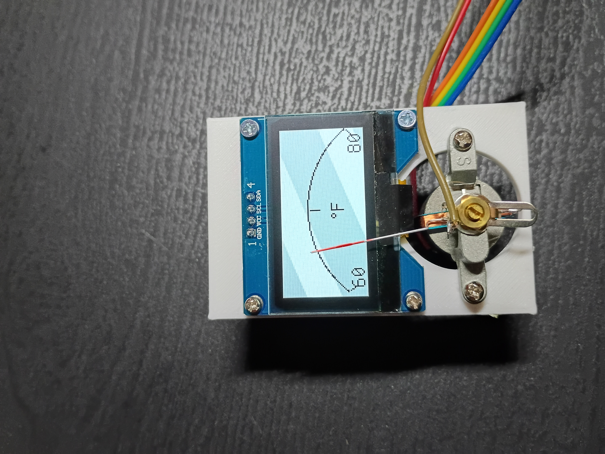
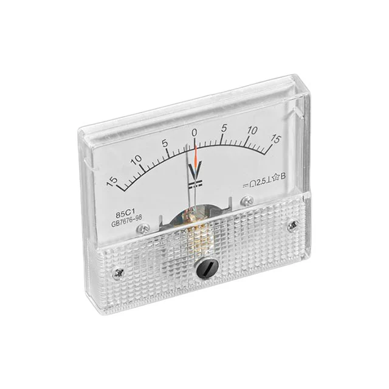

# livegauge
This project turns a normal 5V analog voltmeter into a dynamic display that can be used to show any stat. It is set up to display the temperature using a DHT11 module running on an esp32. Use it to display Temperature, humidity, wire it to your PC and have it show GPU / CPU usage. Use api to call weather or stock prices, etc. Make it display ALL of these things and give it a button to swap between them on the fly! The possibilites are endless! Wowza!

## parts
- ESP32 (any microcontroller with I2C and PWM)
- Analog voltmeter (mine was 5V but I don't think it matters since we remove resistor from back)
- 1.54" 128x64 I2C OLED display
- DHT11 temperature sensor
- Jumper wires

## wiring
- OLED SDA -- ESP32 pin 21
- OLED SCL -- ESP32 pin 22
- OLED VCC -- 3.3V
- OLED GND -- GND
- DHT11 data -- pin 2
- DHT11 VCC -- 5V
- DHT11 GND -- GND
- analog meter + -- pin 4
- analog meter - -- GND 

## notes
- The code isn't pretty but it works.
- The semicircle drawing and needle calibration was made specific to my meter. The 3d print was a bit off so it's offcenter / not perfect. There are comments on the code section for tweaking the arc as well as the needle./
- For mounting everything on the 3d printed plate, I reused the screws from the analog voltmeter.
- Right now it includes a function to change the value range depending on what the needle is displaying.

## 3d printing
[View 3D Model](lg_mounting_plate.stl)
